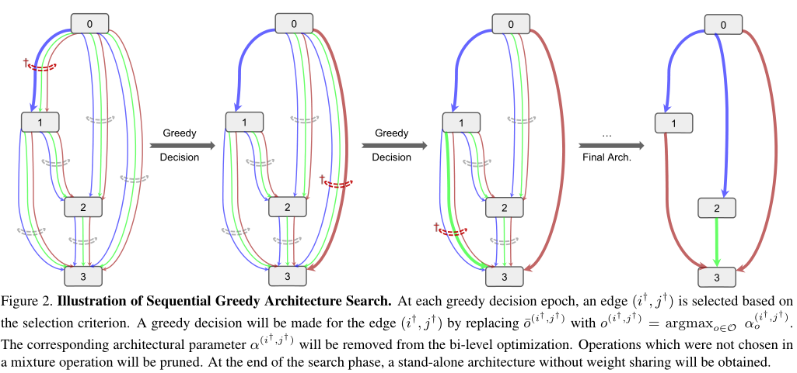

在本文中，我们将图神经网络划分为五大类别，分别是：**图卷积网络（Graph Convolution Networks，GCN）、 图注意力网络（Graph Attention Networks）、图自编码器（ Graph Autoencoders）**、图生成网络（ Graph Generative Networks） 和图时空网络（Graph Spatial-temporal Networks）。

 

来自 <https://zhuanlan.zhihu.com/p/75307407?from_voters_page=true> 

 

GCN方法又可以分为两大类，基于**谱（spectral-based）和基于空间（spatial-based）**。基于谱的方法从图信号处理的角度引入滤波器来定义图卷积，其中图卷积操作被解释为从图信号中去除噪声。基于空间的方法将图卷积表示为从邻域聚合特征信息，当图卷积网络的算法在节点层次运行时，图池化模块可以与图卷积层交错，将图粗化为高级子结构。

 

**谱方法  空间方法**


来自 <https://zhuanlan.zhihu.com/p/75307407?from_voters_page=true> 

0. Chebyshev  
1. https://github.com/blyucs/gae_in_pytorch      T. N. Kipf, M. Welling, [Variational Graph Auto-Encoders](https://arxiv.org/abs/1611.07308), NIPS Workshop on Bayesian Deep Learning (2016) 
2.  https://github.com/blyucs/pygcn   **Semi-Supervised Classification with Graph Convolutional Networks** (GCN 的占坑之作， 但被质疑仅使用拉普拉斯矩阵， 没有做卷积。) **SEMI-GCN**
3. https://github.com/blyucs/RWR-GAE    Code for the paper ["Random Walk Regularized Graph Auto Encoder"](https://arxiv.org/pdf/1908.04003.pdf)     ---- 小众
4. 沈华伟  **图小波神经网络     GWNN   graph wavelet neural network** 
5. GraphSAGE  GNN 
6. GAT   Graph attention network.    
7. PinSAGE
8. FastGCN
9. LGCN  
10.  清华大学孙茂松教授组在 arXiv 发布了论文Graph Neural Networks: A Review of Methods and Applications， 
11. [87] Zhou J, Cui G, Zhang Z, et al. Graph neural networks: A review of methods and applications[J]. 
    ar Xiv preprint arXiv:1812.08434, 2018:1-15. 
    [88] Wu Z, Pan S, Chen F, et al. A comprehensive survey on graph neural networks[J]. arXiv preprint 
    ar Xiv:1901.00596, 2019:1-17. 
    [89] Defferrard M, Bresson X, Vandergheynst P. Convolutional neural networks on graphs with fast 
    localized spectral filtering[C]. Advances in neural information processing systems. 2016: 3844-

12.  第一个是视频，**姜成翰**同学讲授GNN 
13. 此篇文章主要介绍基于空域的前两种代表性方法**MPNN**和**GraphSage**
14. GAT 方法通过自注意力层在训练的过程中得到节点和相邻节点之间的注意力关系，使的
    和节点最相关的邻接节点具有较大关注权重，因此在图神经网络执行的过程中，获得更好的
    节点向量表示

数据集：

1.  CORA：  We follow the same setting used in semi-GCN that allows 20 nodes per class for training, 500 nodes for validation and 1,000 nodes for testing.
2.  pubmed
3.  空手道俱乐部
4.  citeceer

5.  protein-protein interaction (PPI) dataset,   which contains 20 graphs for training, two graphs for validation, and two graphs for testing. There are 2,372 nodes in each graph on average. Each node has 50 features including positional, motif genes and signatures. Each node has multiple labels from 121 classes.   


知乎   阿泽。 

 https://www.zhihu.com/column/c_1212783591505170432 

虽然深度学习有效地捕获了欧几里得数据的隐藏模式，但数据以图形形式表示的应用越来越多。例如，在电子商务中，以图形为基础的学习系统可以利用用户与产品之间的互动，作出高度准确的推荐。在化学中，分子被建模为图形，他们的生物活性需要被识别为药物发现。在引文网络中，论文通过引文相互链接，需要被分类到不同的组中。图数据的复杂性给现有的机器学习算法带来了重大挑战。由于图可能是不规则的，一个图可能有大小不等的无序节点，而来自图的节点可能有不同数量的邻居，这导致一些重要的操作(比如卷积)在图像域中容易计算，但很难应用到图域中。此外，**现有机器学习算法的一个核心假设是实例是相互独立的**。这个假设不再适用于图形数据，因为**每个实例(节点)通过各种类型的链接(比如引用、友谊和交互)与其他实例(节点)相关联。**


network embeding 。。  


 `DGL`和`PyG`都支持`PyTorch`，这两个库各有优点，其实如果熟悉了图神经网络的基本原理，这两个库上手都很快，而且他们也都提供了很多实现好的例子。引用`DGL`的作者的话 

```tex
Overall, I think both frameworks have their merits. PyG is very light-weighted and has lots of off-the-shelf examples. In DGL, we put a lot of efforts to cover a wider range of scenarios. Many of them are not necessarily GNNs but share the principles of structural/relational learning. 
```


在本文中，我们将图神经网络划分为五大类别，分别是：**图卷积网络（Graph Convolution Networks，GCN）、 图注意力网络（Graph Attention Networks）、图自编码器（ Graph Autoencoders）**、图生成网络（ Graph Generative Networks） 和图时空网络（Graph Spatial-temporal Networks）。

 

来自 <https://zhuanlan.zhihu.com/p/75307407?from_voters_page=true> 

 

GCN方法又可以分为两大类，基于谱（spectral-based）和基于空间（spatial-based）。基于谱的方法从图信号处理的角度引入滤波器来定义图卷积，其中图卷积操作被解释为从图信号中去除噪声。基于空间的方法将图卷积表示为从邻域聚合特征信息，当图卷积网络的算法在节点层次运行时，图池化模块可以与图卷积层交错，将图粗化为高级子结构。

 

来自 <https://zhuanlan.zhihu.com/p/75307407?from_voters_page=true> 

 

虽然DeepWalk是KDD 2014的工作，但却是我们了解Graph Embedding无法绕过的一个方法。

我们都知道在NLP任务中，word2vec是一种常用的word embedding方法，word2vec通过语料库中的句子序列来描述词与词的共现关系，进而学习到词语的向量表示。

DeepWalk的思想类似word2vec，使用图中节点与节点的共现关系来学习节点的向量表示。那么关键的问题就是如何来描述节点与节点的共现关系，DeepWalk给出的方法是使用随机游走(RandomWalk)的方式在图中进行节点采样。

RandomWalk是一种可重复访问已访问节点的深度优先遍历算法。给定当前访问起始节点，从其邻居中随机采样节点作为下一个访问节点，重复此过程，直到访问序列长度满足预设条件。

获取足够数量的节点访问序列后，使用skip-gram model 进行向量学习。

 

来自 <https://zhuanlan.zhihu.com/p/56380812> 


NAS_+GCN：

SGAS:

1.  Kendall τ coefficient  ？  整合对， 不整合对
2.  


3. 

1）GraphNAS: Graph Neural Architecture Search with Reinforcement Learning --- **opensource** 中科院 IJCAI

2）Auto-GNN: Neural Architecture Search of Graph Neural Networks 

3）Simplifying Architecture Search for Graph Neural Network

4）Neural Architecture Search in Graph Neural Networks --- **opensource** based on GraphNAS


FSS-GCN: A Graph Convolutional Networks with Fusion of Semantic and Structure for Emotion Cause Analysis   --- 哈工大深圳    KBS


按照与基线方法相同的实验设置，我们允许每个类有20个节点用于训练，分别使用500和1000个节点进行验证和测试。

transductive ： cora，citeseer， pubmed  /////   inductive： PPI 

PPI（蛋白质间相互作用）数据集包含了24张图，对应了不同的人体组织。节点最多可以有121种标签（比如蛋白质的一些性质、所处位置等）。因此节点标签被表示为有个121元素的二元张量。数据集的任务是预测节点标签。

我们使用了20张图进行训练，2张图进行验证，2张图进行测试。平均下来每张图有2372个节点。每个节点有50个特征，包含定位基因集合、特征基因集合以及免疫特征。至关重要的是，测试用图在训练过程中对模型完全不可见。这一设定被称为归纳学习。

1. 微小的差别导致图网络效果差别非常大